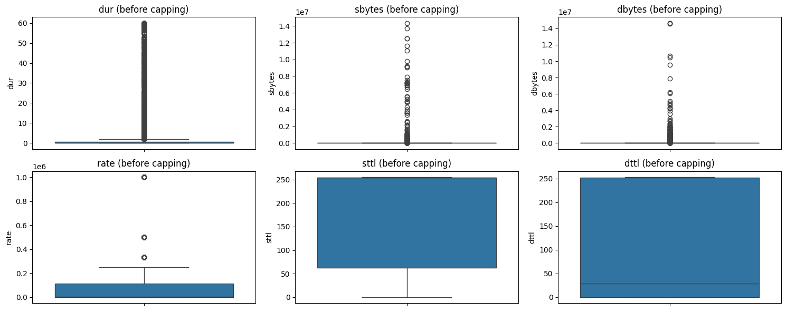
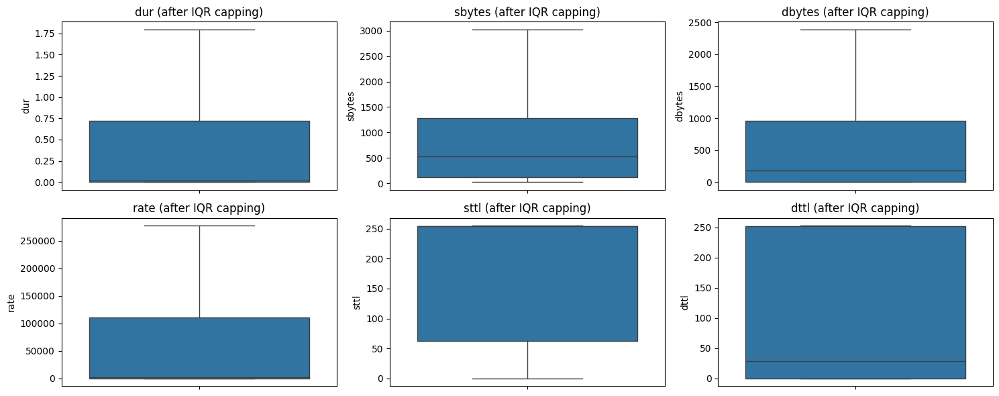

# 🔍 AIML Internship – Task 1: Data Cleaning & Preprocessing (UNSW‑NB15)

## 🎯 Objective  
Learn to clean and prepare raw network intrusion data for machine learning. This task focuses on:

- Handling missing values  
- Encoding categorical features  
- Detecting and capping outliers  
- Scaling numerical features  
- Preparing a clean, model‑ready dataset  

The final output is a cleaned version of the **UNSW‑NB15** dataset, ready for use in intrusion detection models.

---

## 🛠️ Tools & Environment  
- **Python 3.12**  
- **Jupyter Notebook** (VS Code)  
- **Libraries**:  
  - `pandas`, `numpy` – data manipulation  
  - `matplotlib`, `seaborn` – visualisation  
  - `scikit-learn` – imputation, encoding, scaling  

---

## 📂 Dataset  
**UNSW‑NB15** is a modern network intrusion detection dataset containing:

- **Training set**: 82,332 rows, 45 features  
- **Test set**: 175,341 rows, 45 features  
- **Features**:  
  - Numeric (e.g., `dur`, `sbytes`, `rate`)  
  - Categorical (e.g., `proto`, `service`, `state`)  
  - Target: `label` (0 = normal, 1 = attack) and `attack_cat`  

The dataset is stored in the `UNSW_NB15_dataset.zip` file.  
- `UNSW_NB15_training-set.csv`  
- `UNSW_NB15_testing-set.csv`  
- `NUSW-NB15_features.csv` (feature descriptions)

### Why I Chose the UNSW-NB15 Dataset

The **UNSW-NB15** dataset was selected for this task because it is a modern and realistic benchmark for network intrusion detection. Unlike older datasets such as **KDD Cup 99**, it offers several advantages:
- **Contemporary attack families**  
  Includes **9 modern attack types**—*Fuzzers, Analysis, Backdoors, DoS, Exploits, Generic, Reconnaissance, Shellcode,* and *Worms*—alongside normal network traffic.
- **Real network traffic**  
  Captured using modern tools such as **tcpdump** and generated with realistic background traffic, making it more representative of real-world network environments.
- **Rich feature set**  
  Contains **49 features** (reduced to **45 after cleaning**) that combine flow-based, content-based, and time-based attributes, making it well suited for data preprocessing and machine learning tasks.
- **Sufficient dataset size**  
  Comprises **257,673 total records** (**82,332 training samples** and **175,341 testing samples**), providing enough data for meaningful machine learning experiments without being excessively large.
- **Class imbalance**  
  Reflects real-world cybersecurity scenarios where attack instances are less frequent than normal traffic, allowing students to explore techniques for handling imbalanced datasets during model development.
---

## 🔧 Step‑by‑Step Cleaning Pipeline  

### 1. Import Libraries & Load Data  
```python
import pandas as pd
import numpy as np
import matplotlib.pyplot as plt
import seaborn as sns
from sklearn.preprocessing import OrdinalEncoder, StandardScaler
from sklearn.impute import SimpleImputer
```

### 2. Initial Exploration  
- Training shape: `(82332, 45)`  
- Test shape: `(175341, 45)`  
- No missing values in the raw dataset – a good starting point.

### 3. Handling Missing Values (Imputation)  
Even though no missing values were found, we implemented robust imputation:

- **Numerical columns**: Median imputation (robust to outliers)  
- **Categorical columns**: Mode (most frequent) imputation  

```python
imputer_num = SimpleImputer(strategy='median')
imputer_cat = SimpleImputer(strategy='most_frequent')
```
*Result:* No missing values remain after imputation.

### 4. Encoding Categorical Features  

| Feature | Encoding Method | Reason |
|---------|----------------|--------|
| `proto` | One‑hot encoding | Nominal (no order) |
| `service` | One‑hot encoding | Nominal (no order) |
| `state` | Ordinal encoding | Slight natural order (e.g., FIN, CON, INT) + handles unseen labels |

After one‑hot encoding, the number of columns increased from 45 → **185** (due to many rare protocol/service values).  

The test set was aligned with the training set columns to prevent feature mismatch.

### 5. Outlier Detection & Capping (Winsorizing)  

We used the **IQR (Interquartile Range)** method to identify extreme values.  
Instead of removing rows (which can delete attack traffic), we **capped** outliers to the upper/lower bounds derived from the training set.

```python
def cap_outliers_iqr(df, column):
    Q1 = df[column].quantile(0.25)
    Q3 = df[column].quantile(0.75)
    IQR = Q3 - Q1
    lower = Q1 - 1.5 * IQR
    upper = Q3 + 1.5 * IQR
    df[column] = df[column].clip(lower, upper)
    return df
```

**Before Capping** – boxplots show extreme tails:  


**After Capping** – boxplots show compressed ranges, no rows removed:  


> 🧠 *Why cap instead of remove?*  
> In network intrusion data, outliers often represent **real attack patterns** (e.g., sudden high byte counts). Removing them would cripple a model’s ability to detect attacks. Capping preserves all rows while limiting the influence of extreme noise.

### 6. Feature Scaling (Standardisation)  

We applied `StandardScaler` to 12 numerical features to give them zero mean and unit variance – essential for distance‑based algorithms (SVM, k‑NN, PCA).

```python
scaler = StandardScaler()
train_df[num_features] = scaler.fit_transform(train_df[num_features])
test_df[num_features] = scaler.transform(test_df[num_features])
```

**Result**: Mean ≈ 0, Std ≈ 1 for all scaled features.

### 7. Save Cleaned Data  
- `UNSW_NB15_training_cleaned.csv` (82,332 rows, 185 columns)  
- `UNSW_NB15_testing_cleaned.csv` (175,341 rows, 185 columns)  

Both files are included in `UNSW_NB15_cleaned.zip`.

---

## 📊 Key Findings  

| Metric | Raw Dataset | After Cleaning |
|--------|-------------|----------------|
| Training rows | 82,332 | 82,332 (all preserved) |
| Testing rows | 175,341 | 175,341 |
| Number of features | 45 | 185 (after one‑hot encoding) |
| Missing values | 0 | 0 (imputed) |
| Outlier handling | – | Capped (winsorized) |
| Feature scaling | – | StandardScaler applied |

- **No data loss** – outlier capping kept all rows.  
- **Test set untouched** – only transformed using training set parameters (no leakage).  
- **One‑hot encoding** increased dimensionality but preserves all categorical information.  
- **State encoding** uses ordinal values with `unknown_value=-1` to handle unseen categories gracefully.

---

## 🧪 Why These Choices Matter for ML  

| Step | Rationale |
|------|-----------|
| Median imputation | Robust against outliers; better than mean for skewed network data. |
| One‑hot encoding | No false ordinal relationships introduced. |
| Winsorizing (capping) | Preserves attack samples, only limits extreme values. |
| Standard scaling | Required for models like SVM, logistic regression, k‑NN. |
| Separate fit/transform | Prevents data leakage from test set into training. |

---

## 📁 Files In The Repository

| File | Description |
|------|-------------|
| `cleaning_and_preprocessed.ipynb` | Full Jupyter notebook with all cleaning steps, visualisations, and outputs. (GitHub may not render it; use the PDF for viewing.) |
| `cleaning_and_preprocessed.pdf` | Exported PDF version of the notebook – viewable directly on GitHub. |
| `UNSW_NB15_dataset.zip` | Original dataset (training + test + feature descriptions). |
| `UNSW_NB15_cleaned.zip` | Final cleaned CSV files ready for modelling. |
| `Before Capping.png` | Boxplots of numerical features **before** outlier capping. |
| `After IQR Capping.png` | Boxplots **after** capping – extreme values compressed, rows intact. |
| `README.md` | This documentation. |

> **Note**: The `.ipynb` file may not render correctly on GitHub due to large outputs or interactive components. Please download it locally or use the included `.pdf` for reference.

---

## ✅ Conclusion  

This task successfully demonstrated a complete, production‑ready data cleaning pipeline for the UNSW‑NB15 dataset. The cleaned data preserves all original rows, handles categorical variables appropriately, caps outliers without deletion, and scales numerical features – all while preventing data leakage.  

The output datasets (`training_cleaned.csv` and `testing_cleaned.csv`) are ready for the next stage: **exploratory data analysis (EDA)** and **building classification models** for intrusion detection.

---

## 📚 References  

- [UNSW‑NB15 Dataset](https://research.unsw.edu.au/projects/unsw-nb15-dataset)  
- [Pandas Documentation](https://pandas.pydata.org/)  
- [Scikit‑learn Preprocessing](https://scikit-learn.org/stable/modules/preprocessing.html)  
- [IQR Outlier Detection](https://en.wikipedia.org/wiki/Interquartile_range)
