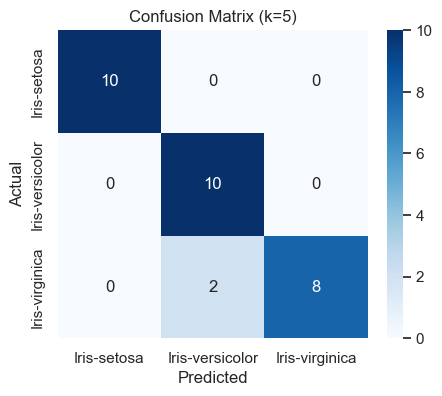
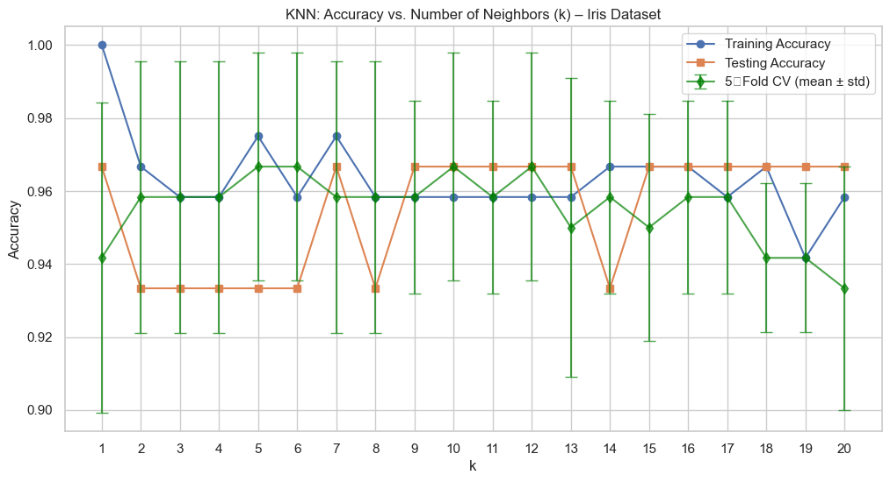
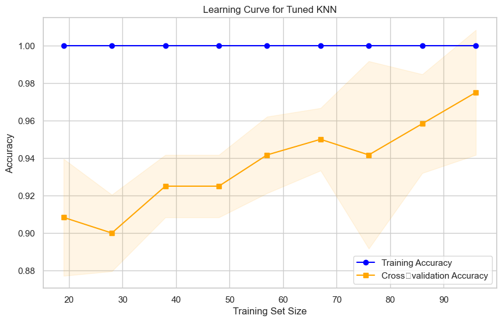
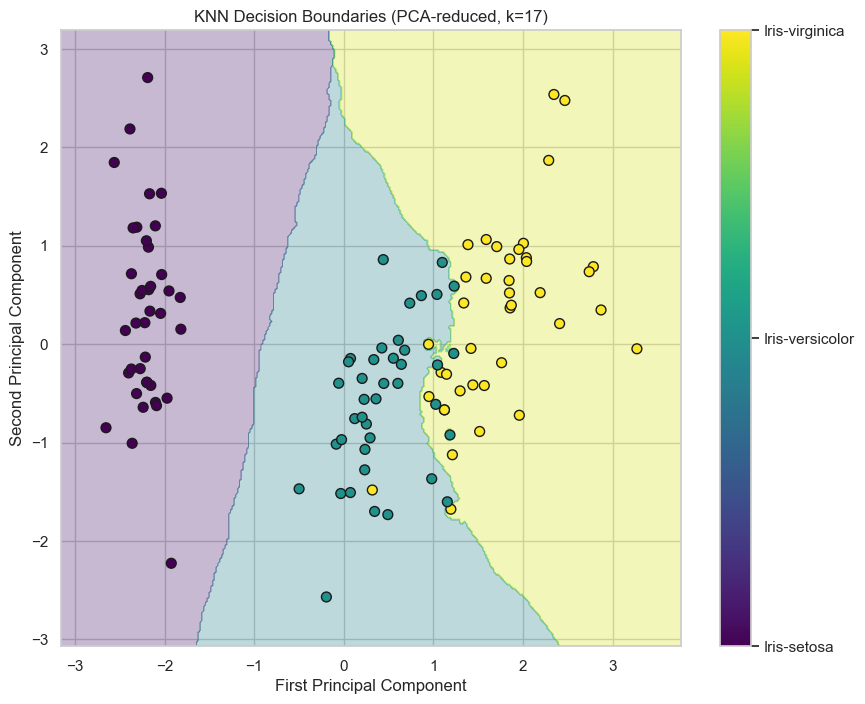
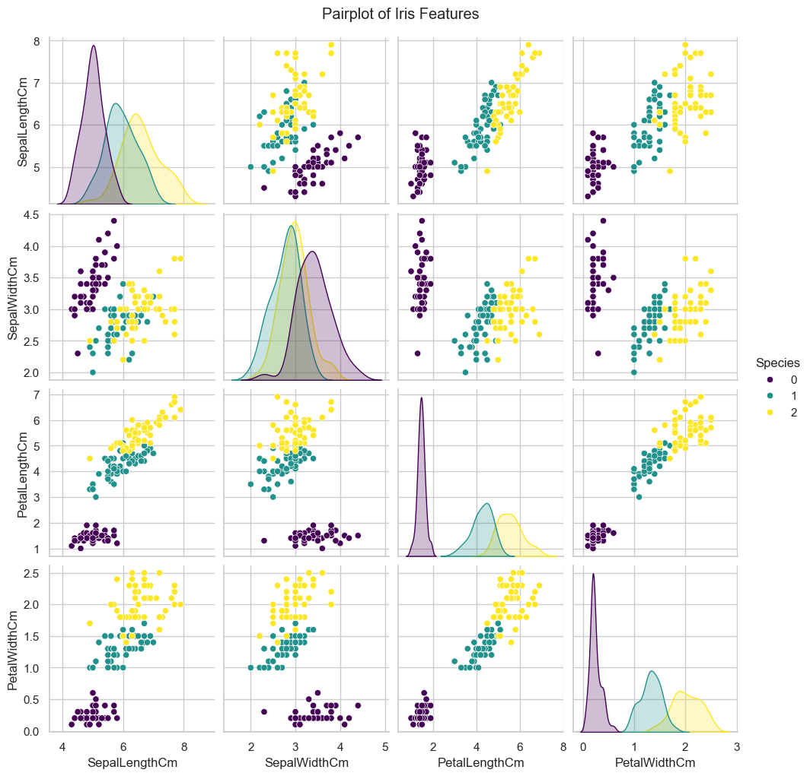
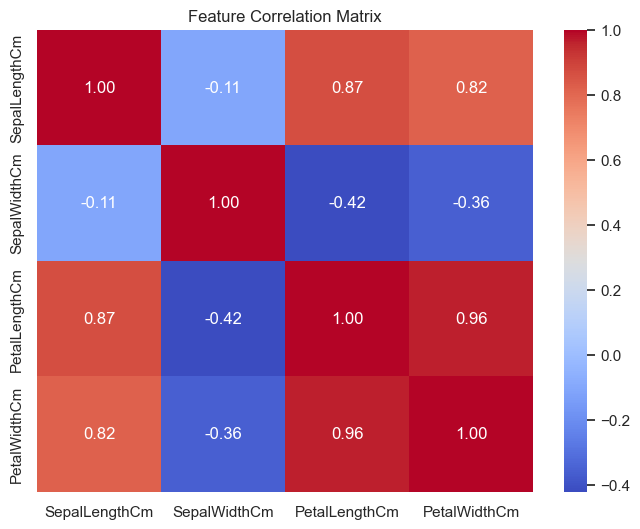

# 🌸 AIML Internship Task 6: K-Nearest Neighbors (KNN) Classification – Iris Dataset

## 🎯 Objective  
Implement the K‑Nearest Neighbors (KNN) algorithm to classify iris flowers into three species (*Setosa*, *Versicolor*, *Virginica*).  
The task covers data preprocessing, normalisation, model training, hyperparameter tuning, evaluation, cross-validation, and visualisation of decision boundaries.

---

## 🛠️ Tools & Environment  
- **Python 3.12**  
- **Jupyter Notebook**  
- **Libraries**:  
  - `pandas`, `numpy` – data handling  
  - `matplotlib`, `seaborn` – visualisations  
  - `scikit-learn` – KNN, decision tree, scaling, PCA, metrics, grid search, learning curve  

---

## 📂 Dataset  
The dataset `Iris.csv` contains **150 rows** and **6 columns** (including an unused `Id` column). After dropping `Id`, we have 4 numerical features and the target species.

| Feature | Description |
|---------|-------------|
| SepalLengthCm | Sepal length in cm |
| SepalWidthCm  | Sepal width in cm  |
| PetalLengthCm | Petal length in cm |
| PetalWidthCm  | Petal width in cm  |
| Species       | Target class (Iris-setosa, Iris-versicolor, Iris-virginica) |

### Target distribution (after label encoding):
| Class            | Count |
|------------------|-------|
| Iris-setosa      | 50    |
| Iris-versicolor  | 50    |
| Iris-virginica   | 50    |

---

## 📊 Preprocessing Steps  

1. **Check missing values** – none present.  
2. **Drop `Id` column** – not needed.  
3. **Encode target labels** – using `LabelEncoder`.  
4. **Train-test split** – 80% training, 20% testing (`random_state=42`, `stratify=y`).  
5. **Feature scaling** – `StandardScaler` (crucial for distance-based KNN).  

---

## 🤖 Model Training  

### Baseline KNN (k = 5)
Trained on scaled features.

| Metric | Value |
|--------|-------|
| Test Accuracy | 0.9333 |

**Classification Report (k=5):**

| Class            | Precision | Recall | F1-score |
|------------------|-----------|--------|----------|
| Iris-setosa      | 1.00      | 1.00   | 1.00     |
| Iris-versicolor  | 0.83      | 1.00   | 0.91     |
| Iris-virginica   | 1.00      | 0.80   | 0.89     |

---

## 📈 Effect of k – Cross‑Validation

- k values tested: 1 to 20  
- 5‑fold cross‑validation on training set  
- **Best k by test accuracy**: 1 (accuracy = 0.9667)  
- **Best k by CV mean**: 5 (CV accuracy = 0.9667)

The plot includes training accuracy, testing accuracy, and cross‑validation mean ± std.  
Small k values can overfit; large k values smooth boundaries but may underfit.

---

## 🔧 Hyperparameter Tuning (GridSearchCV)

Searched over:
- `n_neighbors`: 1–20  
- `weights`: `uniform`, `distance`  
- `metric`: `euclidean`, `manhattan`, `chebyshev`

| Best parameters | `{'metric': 'euclidean', 'n_neighbors': 17, 'weights': 'distance'}` |
|----------------|--------------------------------------------------------------------|
| Best CV accuracy | 0.975 |
| Test accuracy (tuned) | 0.9667 |

---

## 📉 Learning Curve (Tuned KNN)

- Training and cross‑validation scores converge as training set size increases.  
- Small gap indicates low variance – the model generalises well.

---

## 🌲 Comparison with Decision Tree

| Model | Test Accuracy |
|-------|---------------|
| KNN (default k=5) | 0.9333 |
| KNN (tuned) | 0.9667 |
| Decision Tree (max_depth=3) | 0.9667 |

Both tuned KNN and a shallow decision tree achieve the same accuracy on this test set.

---

## 🧭 Visualising Decision Boundaries (2D PCA)

PCA reduced the 4‑dimensional feature space to 2 principal components.  
The KNN classifier (tuned) decision boundaries are plotted in this reduced space.

- **Setosa** is clearly separable.  
- **Versicolor** and **Virginica** share a more complex boundary, reflecting the original feature overlap.

---

## 📊 Exploratory Data Analysis (EDA)

### Pair Plot

Shows class separability across all feature pairs. Setosa is easily distinguished; Versicolor and Virginica overlap in some dimensions.

### Correlation Heatmap

- Petal length and petal width are highly correlated (~0.96).  
- Sepal width is weakly negatively correlated with other features.

---

## 🔑 Key Insights

| Finding | Implication |
|---------|-------------|
| KNN achieves >93% accuracy even with default k=5 | Effective for well‑separated classes |
| Tuning improves CV score to 0.975 | Hyperparameter optimisation beneficial |
| Best k = 17 (weighted by distance) | Suggests non‑uniform influence of neighbours |
| PCA decision boundaries show separation | Visual confirmation of classification logic |
| Scaling is essential for KNN | Distance metric sensitive to magnitude |

---

## 📁 Repository Files  

| File | Description |
|------|-------------|
| `Iris.csv` | Original dataset |
| `knn_clasification.ipynb` | Full implementation notebook |
| `knn_clasification.pdf` | Exported report |
| `README.md` | Documentation |
| `Graphs/` | All generated plots (confusion matrix, learning curve, pair plot, etc.) |
| `Graphs/Information_of_the_graphs.md` | Explanation of each graph |

---

## ⚠️ Note  
The `.ipynb` file may not render properly on GitHub. Please use the PDF version for full viewing.

---

## ✅ Conclusion  

K‑Nearest Neighbors is a simple yet powerful classifier for the Iris dataset. With proper scaling and hyperparameter tuning, it achieves near‑perfect accuracy. The learning curve confirms good generalisation, and PCA‑based decision boundaries provide an intuitive visualisation of class separation. A comparison with a decision tree shows both models perform similarly, underscoring the value of exploring multiple algorithms.

---

## 📚 References  

- Scikit‑learn KNN Documentation  
- Fisher, R. A. (1936). "The use of multiple measurements in taxonomic problems"  
- UCI Machine Learning Repository – Iris Data Set  
- Hastie, T., Tibshirani, R., & Friedman, J. (2009). *The Elements of Statistical Learning*
