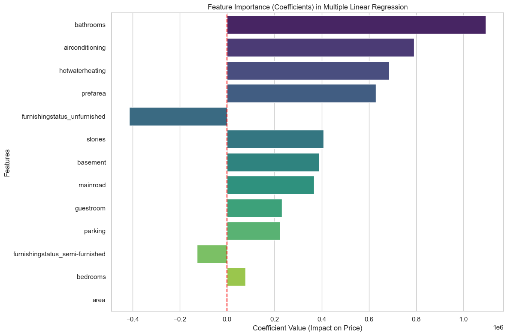
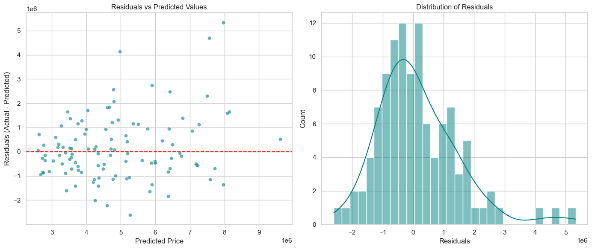

# 🏡 AIML Internship - Task 3: Linear Regression (House Price Prediction)

## 🎯 Objective  
Build and evaluate **Simple** and **Multiple Linear Regression** models to predict house prices based on various features (area, number of bedrooms, bathrooms, stories, amenities, etc.).  
The goal is to understand the relationship between housing characteristics and price, assess model performance, diagnose linear regression assumptions, and explore regularisation techniques to handle potential overfitting.

---

## 🛠️ Tools & Environment  
- **Python 3.12**  
- **Jupyter Notebook** (VS Code)  
- **Libraries**:  
  - `pandas`, `numpy` – data handling  
  - `matplotlib`, `seaborn` – visualisations  
  - `scikit-learn` – preprocessing, modelling, metrics, cross‑validation  

---

## 📂 Dataset  
The dataset `Housing.csv` contains **545 rows** and **13 columns**:

| Column | Description |
|--------|-------------|
| `price` | Target variable – house price (in local currency) |
| `area` | Total area (sq ft) |
| `bedrooms`, `bathrooms`, `stories` | Counts |
| `mainroad`, `guestroom`, `basement`, `hotwaterheating`, `airconditioning`, `prefarea` | Binary amenities (`yes`/`no`) |
| `parking` | Number of parking spaces (0–3) |
| `furnishingstatus` | Categorical (`furnished`, `semi-furnished`, `unfurnished`) |

> Source: Typical real‑estate dataset used for regression tutorials.

---

## 📊 Preprocessing Steps  

1. **Binary encoding**: Converted `yes`/`no` columns to `1`/`0`.  
2. **One‑hot encoding**: Applied to `furnishingstatus` (dropped first category to avoid dummy trap).  
3. **Feature‑target split**:  
   - `X` = all features except `price`  
   - `y` = `price`  
4. **Train‑test split**: 80% training, 20% testing (`random_state=42` for reproducibility).  
   - Saved split files: `X_train.csv`, `X_test.csv`, `y_train.csv`, `y_test.csv` (in `train_test_split.zip`).

---

## 📈 Models & Evaluation  

### 1. Simple Linear Regression (Price vs. Area)  
Trained only on the `area` feature to establish a baseline.

| Metric | Value |
|--------|-------|
| MAE | 1,474,748.13 |
| MSE | 3,675,286,604,768.19 |
| R² | **0.2729** |

📉 **Interpretation**: Area alone explains only ~27% of the variance in price – other features are essential.

### 2. Multiple Linear Regression (All Features)  
Used all 13 features after preprocessing.

| Metric | Value |
|--------|-------|
| MAE | 970,043.40 |
| MSE | 1,754,318,687,330.66 |
| R² | **0.6529** |

✅ **Interpretation**: The model explains ~65% of price variance. MAE dropped by ~500k compared to the simple model.

### 3. Regularised Models (Ridge & Lasso)  
Features were standardised using `StandardScaler` before fitting Ridge (L2) and Lasso (L1) with `alpha=1.0`.

| Model | R² |
|-------|-----|
| Multiple Linear (unregularised) | 0.6529 |
| Ridge (L2) | 0.6528 |
| Lasso (L1) | 0.6529 |

> No significant improvement with default `alpha`, and Lasso did not shrink any coefficient to zero.

### 4. K‑Fold Cross‑Validation (5‑fold)  
Applied to the Multiple Linear Regression model on the whole dataset.

| Fold | R² |
|------|-----|
| 1 | -2.0876 |
| 2 | -5.1563 |
| 3 | -16.3449 |
| 4 | -20.8070 |
| 5 | -5.1641 |

- **Mean R²**: **-9.91**  
- **Std Dev**: **7.30**

⚠️ **Critical finding**: The cross‑validation scores are **strongly negative**, indicating **overfitting** (model performs well on one train/test split but fails on other data subsets). Possible causes: small dataset (545 rows), outliers, or non‑linear relationships not captured by linear regression.

---

## 📉 Diagnostic Plots & Residual Analysis  

### Simple Linear Regression Line  
  
The red line shows the linear fit; the scatter reveals large residuals, confirming that `area` alone is insufficient.

### Feature Importance (Multiple Linear Coefficients)  
  

**Top positive contributors**: `bathrooms`, `airconditioning`, `hotwaterheating`, `prefarea`, `stories`.  
**Negative contributors**: `furnishingstatus_unfurnished` (unfurnished houses reduce price).  
→ Amenities and number of bathrooms have a strong positive impact on price.

### Residual Analysis  
  

- **Left plot (Residuals vs Predicted)**: Spread increases with predicted price → **heteroscedasticity** (variance not constant).  
- **Right plot (Histogram)**: Residuals are slightly right‑skewed, not perfectly normal.  
→ Linear regression assumptions are partially violated, suggesting non‑linear models may perform better.

---

## 🧠 Key Insights  

| Finding | Implication |
|---------|--------------|
| Multiple Linear R² = 0.65 | Acceptable but not excellent; room for improvement. |
| Negative cross‑validation R² | Model **overfits** on the small dataset. |
| Heteroscedastic residuals | Linear model may not capture all variance; try **log transformation** of target or non‑linear models. |
| Important features | `bathrooms`, `area`, `airconditioning`, `hotwaterheating`, `prefarea`, `stories`. |
| Regularisation no improvement | Default `alpha` not tuned; could be optimised via grid search. |
| Dataset size (545 rows) | Small – consider bootstrapping or acquiring more data. |

---

## 📁 Repository Files  

| File | Description |
|------|-------------|
| `Housing.csv` | Original dataset. |
| `Regression_model_on_house_price_prediction.ipynb` | Complete notebook with code and outputs. |
| `Regression_model_on_house_price_prediction.pdf` | PDF export (viewable on GitHub). |
| `train_test_split.zip` | Train/test CSV files for reproducibility. |
| `Graphs/` | Contains all generated plots (`.png`) and `information_of_graphs.md`. |
| `README.md` | This documentation. |

> **Note**: The `.ipynb` may not render fully on GitHub; please download or use the PDF.

---

## ✅ Conclusion  

The Linear Regression models provide a **moderate fit** (R² ≈ 0.65) on the given test split, but **cross‑validation reveals severe overfitting** due to the small dataset and potential non‑linearity.  
Residual plots confirm violations of homoscedasticity and normality.  

Despite these limitations, the analysis successfully identifies the most influential housing features (bathrooms, area, air conditioning, hot water heating, preferred area) and demonstrates a complete machine learning pipeline: preprocessing, training, evaluation, residual diagnostics, regularisation, and cross‑validation.

---

## 📚 References  

- [Scikit‑learn Linear Regression Documentation](https://scikit-learn.org/stable/modules/generated/sklearn.linear_model.LinearRegression.html)  
- [Ridge and Lasso Regression](https://scikit-learn.org/stable/auto_examples/linear_model/plot_ridge_path.html)  
- [Understanding R² and Cross‑Validation](https://scikit-learn.org/stable/modules/cross_validation.html)  
- Dataset source: Typical housing data used for educational regression tasks.
