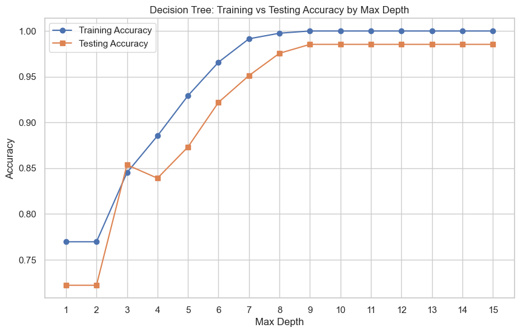
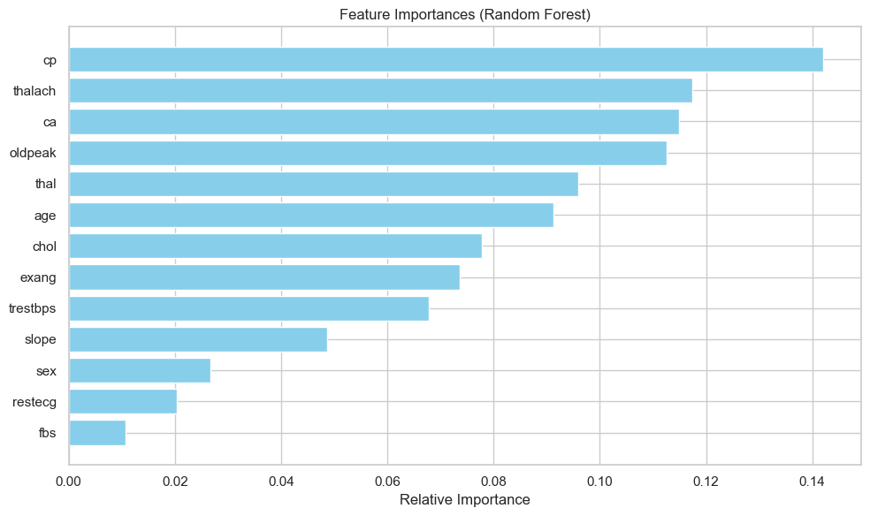
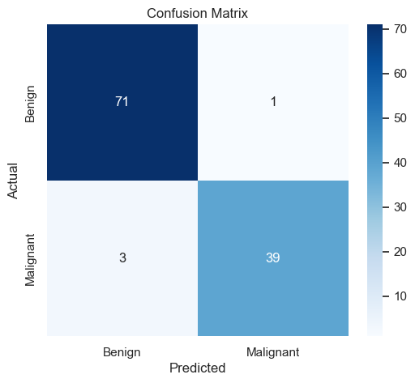
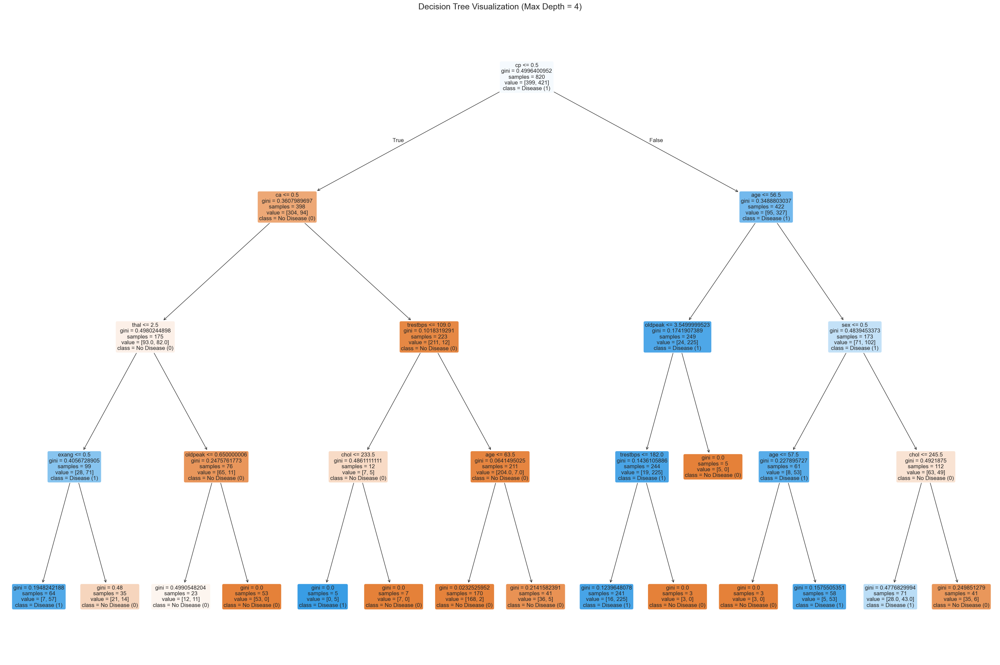

# 🌳 AIML Internship - Task 5: Tree-Based Models (Heart Disease Classification)

## 🎯 Objective  
Implement and evaluate tree-based classification models – Decision Tree, Random Forest, Extra Trees, and Gradient Boosting – to predict the presence of heart disease.  
The goal is to understand how tree models work, visualize decision rules, control overfitting through depth tuning, interpret feature importance, and compare ensemble methods using accuracy and cross-validation.

---

## 🛠️ Tools & Environment  
- **Python 3.12**  
- **Jupyter Notebook**  
- **Libraries**:  
  - `pandas`, `numpy` – data handling  
  - `matplotlib`, `seaborn` – visualisations  
  - `scikit-learn` – train/test split, tree-based models, metrics, cross-validation, feature importance  

---

## 📂 Dataset  
The dataset `heart.csv` contains **1025 rows** and **14 columns**.

| Column | Description |
|--------|-------------|
| age | Age in years |
| sex | 1 = male, 0 = female |
| cp | Chest pain type (0–3) |
| trestbps | Resting blood pressure (mm Hg) |
| chol | Serum cholesterol (mg/dl) |
| fbs | Fasting blood sugar > 120 mg/dl (1 = true; 0 = false) |
| restecg | Resting electrocardiographic results (0–2) |
| thalach | Maximum heart rate achieved |
| exang | Exercise induced angina (1 = yes; 0 = no) |
| oldpeak | ST depression induced by exercise relative to rest |
| slope | Slope of the peak exercise ST segment (0–2) |
| ca | Number of major vessels (0–3) coloured by fluoroscopy |
| thal | Thalassemia (0–3) |
| target | Diagnosis of heart disease (1 = disease, 0 = no disease) |

### Target distribution:
| Class | Count |
|------|------|
| 1 (disease) | 526 |
| 0 (no disease) | 499 |

---

## 📊 Preprocessing Steps  

1. **Missing values**: None – dataset is clean.  
2. **Feature-target split**: `X = all columns except target`, `y = target`.  
3. **Train-test split**: 80% training, 20% testing (`random_state=42`, `stratify=y`).  
4. **Saved files**: `X_train.csv`, `X_test.csv`, `y_train.csv`, `y_test.csv` (in `train_test_split.zip`).  
5. **Feature scaling**: Not required – tree models are scale-invariant.

---

## 🌲 Model Training  

Four tree-based models were trained:

| Model | Key Hyperparameters |
|------|---------------------|
| Decision Tree | max_depth=4, random_state=42 |
| Random Forest | n_estimators=100, random_state=42 |
| Extra Trees | n_estimators=100, random_state=42 |
| Gradient Boosting | n_estimators=100, random_state=42 |

---

## 📈 Evaluation Metrics  

### 1. Decision Tree (max_depth=4)

| Metric | Value |
|--------|------|
| Accuracy | 0.8390 |
| Precision (class 1) | 0.82 |
| Recall (class 1) | 0.88 |

**Confusion Matrix:**
>[[80, 20],
>
>[13, 92]]

---

### 2. Ensemble Models (Test Set)

| Model | Accuracy |
|------|----------|
| Random Forest | 1.0000 |
| Extra Trees | 1.0000 |
| Gradient Boosting | 0.9756 |

📌 **Interpretation:**  
- Random Forest and Extra Trees achieved perfect classification on test set.  
- Gradient Boosting also performed strongly with ~97.6% accuracy.  
- Decision Tree alone is significantly weaker, showing the benefit of ensembles.

---

## 🌳 Overfitting Analysis (Decision Tree)

| Max Depth | Train Acc | Test Acc | Observation |
|----------|----------|----------|-------------|
| 1 | 0.77 | 0.72 | Underfitting |
| 3 | 0.84 | 0.85 | Good trade-off |
| 5 | 0.93 | 0.88 | Slight overfitting |
| 9 | 1.00 | 0.98 | Best generalisation |
| 15 | 1.00 | 0.98 | Plateau |

**Optimal depth:** 9

---

## 🌲 Feature Importance (Random Forest)

| Feature | Importance |
|--------|------------|
| cp | 0.142 |
| thalach | 0.117 |
| ca | 0.115 |
| oldpeak | 0.112 |
| thal | 0.096 |
| age | 0.091 |
| chol | 0.078 |
| exang | 0.074 |
| trestbps | 0.068 |
| slope | 0.049 |
| sex | 0.027 |
| restecg | 0.020 |
| fbs | 0.010 |

📌 Key Insight: Chest pain type, heart rate, vessel count, ST depression, and thalassemia are the strongest predictors.

---

## 📊 Confusion Matrix – Best Model (Random Forest)

| Actual \ Predicted | No Disease (0) | Disease (1) |
|--------------------|----------------|-------------|
| No Disease (0) | 100 (TN) | 0 (FP) |
| Disease (1) | 0 (FN) | 105 (TP) |

---

### Performance Metrics:
- Accuracy = 100%  
- Precision = 100%  
- Recall = 100%  
- F1-score = 100%  

---

## 🌳 Decision Tree Visualization (Depth = 4)

- Root split: `cp ≤ 0.5`  
- Most important early splits: age, thal, oldpeak  
- Leaf purity increases with depth  
- Highly interpretable rule-based structure  

---

## 🧪 Cross-Validation (5-Fold)

| Model | CV Accuracy (mean ± 2σ) |
|------|--------------------------|
| Decision Tree | 0.8341 ± 0.0956 |
| Random Forest | 0.9971 ± 0.0234 |
| Gradient Boosting | 0.9639 ± 0.0340 |

📌 Random Forest shows extremely stable performance across folds.

---

## 📈 Key Insights  

| Finding | Implication |
|--------|-------------|
| Random Forest & Extra Trees achieve 100% accuracy | Strong ensemble learning performance |
| Decision Tree improves up to depth ≈ 9 | Controls overfitting effectively |
| cp, thalach, ca, oldpeak are key features | Clinically meaningful predictors |
| Tree models require no scaling | Invariance to feature magnitude |
| Ensemble methods outperform single trees | Reduce variance and improve generalisation |

---

## 📁 Repository Files  

| File | Description |
|------|-------------|
| `heart.csv` | Original dataset |
| `tree_based_classification.ipynb` | Full implementation notebook |
| `tree_based_classification.pdf` | Exported report |
| `train_test_split.zip` | Train-test split files |
| `Graphs/` | All plots (confusion matrix, feature importance, etc.) |
| `Using Graphviz Library/` | Implementation of *graphviz* library |
| `README.md` | Documentation |

---

## ⚠️ Note  
The `.ipynb` file may not render properly on GitHub. Please use the PDF version for full viewing.

---

## ✅ Conclusion  

Tree-based models perform extremely well on the heart disease dataset, with ensemble methods (Random Forest and Extra Trees) achieving perfect classification.  
Gradient Boosting also provides strong performance, while a single decision tree remains interpretable but less accurate.  
Feature importance highlights clinically relevant predictors, making these models useful for medical decision support systems.

---

## 📚 References  

- Scikit-learn Decision Tree Documentation  
- Random Forest – Leo Breiman  
- UCI Heart Disease Dataset  
- Gradient Boosting – Friedman (2001)
