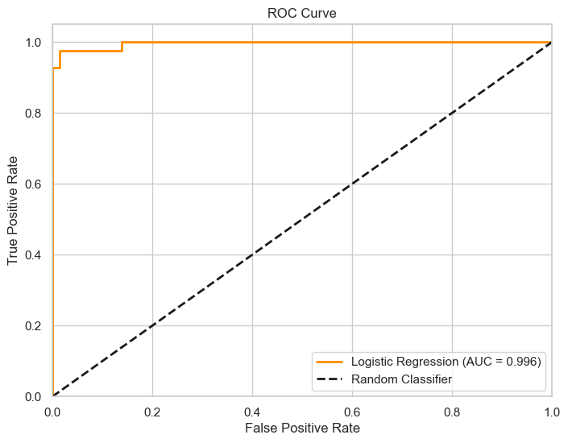
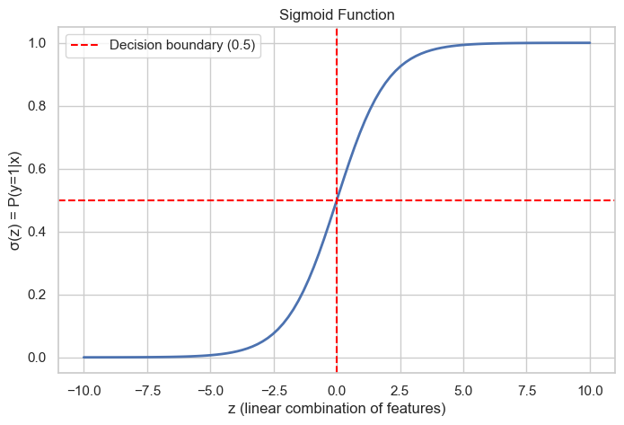

# 🧬 AIML Internship - Task 4: Logistic Regression (Breast Cancer Classification)

## 🎯 Objective  
Build and evaluate a **Logistic Regression** classifier to predict whether a breast tumour is **malignant (M)** or **benign (B)** using the Breast Cancer Wisconsin dataset.  
The goal is to understand binary classification, evaluate model performance using appropriate metrics (confusion matrix, precision, recall, ROC‑AUC), tune the classification threshold, and explain the role of the sigmoid function in probability estimation.

---

## 🛠️ Tools & Environment  
- **Python 3.12**  
- **Jupyter Notebook**  
- **Libraries**:  
  - `pandas`, `numpy` – data handling  
  - `matplotlib`, `seaborn` – visualisations  
  - `scikit-learn` – preprocessing, logistic regression, metrics, ROC curve  

---

## 📂 Dataset  
The dataset `data.csv` contains **569 rows** and **33 columns** (including ID and an empty `Unnamed: 32` column).  
The target is `diagnosis`:

| Value | Meaning |
|-------|---------|
| `M`   | Malignant (cancerous) – **positive class** |
| `B`   | Benign (non‑cancerous) – **negative class** |

All 30 remaining features are numeric measurements of cell nuclei (radius, texture, perimeter, area, smoothness, compactness, concavity, etc.) – both mean values, standard errors, and “worst” values.

---

## 📊 Preprocessing Steps  

1. **Column removal**: Dropped `id` and `Unnamed: 32` (all NaNs).  
2. **Target encoding**: Converted `diagnosis` from `M`/`B` to integers:  
   - `M` → `1` (malignant)  
   - `B` → `0` (benign)  
3. **Feature‑target split**: `X` = 30 numeric features, `y` = `diagnosis`.  
4. **Train‑test split**: 80% training, 20% testing (`random_state=42`, `stratify=y` for balanced class distribution).  
   - Saved split files: `X_train.csv`, `X_test.csv`, `y_train.csv`, `y_test.csv` (packaged in `train_test_split.zip`).  
5. **Feature scaling**: Applied `StandardScaler` (standardisation) to all features – essential for logistic regression convergence.

---

## 🧠 Model Training  
- Algorithm: **Logistic Regression** (scikit‑learn, `solver='lbfgs'`).  
- Trained on the scaled training set.

---

## 📈 Evaluation Metrics  

| Metric | Value |
|--------|-------|
| **Accuracy** | 0.9649 |
| **Precision** (malignant class) | 0.9750 |
| **Recall** (malignant class) | 0.9286 |
| **ROC‑AUC** | 0.9960 |

📌 **Interpretation**:  
- The model correctly identifies **96.5%** of all cases.  
- When it predicts malignant, it is correct **97.5%** of the time (precision).  
- It captures **92.9%** of actual malignant tumours (recall).  
- The **ROC‑AUC of 0.996** indicates near‑perfect discrimination between the two classes.

### Confusion Matrix  
  

|            | Predicted Benign | Predicted Malignant |
|------------|------------------|----------------------|
| Actual Benign | 71               | 1                    |
| Actual Malignant | 3               | 39                   |

- **False Negatives (3)** : 3 malignant tumours misclassified as benign – critical to minimise in medical diagnosis.  
- **False Positives (1)** : 1 benign case wrongly flagged as malignant.

### ROC Curve  
  

The curve climbs steeply to the top‑left, demonstrating excellent class separation. The area under the curve (AUC = 0.996) confirms the model’s high discriminative power.

---

## 🎛️ Threshold Tuning  

The default decision threshold is **0.5** (probability ≥ 0.5 → malignant).  
By varying the threshold, we can trade off precision and recall:

| Threshold | Precision | Recall |
|-----------|-----------|--------|
| 0.3       | 0.9762    | 0.9762 |
| 0.4       | 0.9756    | 0.9524 |
| **0.5**   | **0.9750**| **0.9286** |
| 0.6       | 1.0000    | 0.9048 |
| 0.7       | 1.0000    | 0.9048 |

- **Optimal threshold (max F1‑score)**: **0.24** (F1 = 0.9762).  
- For cancer detection, prioritising **recall** (fewer false negatives) may justify a lower threshold (e.g., 0.3), even at the cost of slightly lower precision.

---

## 🔍 Explanation of Sigmoid Function  

Logistic regression models the probability that an example belongs to the positive class:

$$
P(y=1 \mid \mathbf{x}) = \sigma(\mathbf{w}^T\mathbf{x} + b) = \frac{1}{1 + e^{-(\mathbf{w}^T\mathbf{x} + b)}}
$$

- The **sigmoid** function squashes any real number into the range (0, 1), producing a valid probability.  
- The decision boundary is typically set at 0.5, but can be adjusted as shown above.  
- Training minimises **binary cross‑entropy** (log loss).

  

The plot shows the characteristic S‑shape: inputs far below 0 yield probabilities near 0, inputs far above 0 yield probabilities near 1.

---

## 📉 Key Insights  

| Finding | Implication |
|---------|--------------|
| Accuracy 96.5%, ROC‑AUC 0.996 | Logistic regression performs excellently on this dataset. |
| Recall (0.9286) slightly lower than precision | Slightly more false negatives than false positives. |
| Optimal F1 threshold = 0.24 | Default 0.5 is not optimal for maximising F1. |
| No need for complex models | Linear decision boundary is sufficient due to well‑separated features. |
| Standardisation important | Feature scaling improves convergence and performance. |

---

## 📁 Repository Files  

| File | Description |
|------|-------------|
| `data.csv` | Original Breast Cancer Wisconsin dataset. |
| `logistic_regression.ipynb` | Complete Jupyter notebook with code, outputs, and explanations. |
| `logistic_regression.pdf` | PDF export for easy viewing. |
| `train_test_split.zip` | Contains `X_train.csv`, `X_test.csv`, `y_train.csv`, `y_test.csv` for reproducibility. |
| `Graphs/` | All generated plots: `Confusion_Matrix.png`, `ROC_Curve.png`, `Sigmoid_Function.png`, |
|`Information_of_the_graphs.md` | Detailed information of the Graphs. `(Graphs(dir))`|
| `README.md` | This documentation. |

> **Note**: The `.ipynb` may not render fully on GitHub; please download or use the PDF.

---

## ✅ Conclusion  

Logistic Regression achieves **high accuracy (~96.5%)** and **near‑perfect ROC‑AUC (0.996)** on the Breast Cancer Wisconsin dataset.  
The model correctly identifies most malignant cases, but threshold tuning can further improve recall (reducing false negatives) – an important trade‑off in medical diagnostics.  
The analysis demonstrates a complete binary classification pipeline: preprocessing, scaling, training, evaluation, threshold tuning, and probabilistic interpretation via the sigmoid function.

---

## 📚 References  

- [Scikit‑learn Logistic Regression Documentation](https://scikit-learn.org/stable/modules/generated/sklearn.linear_model.LogisticRegression.html)  
- [Understanding ROC Curves and AUC](https://developers.google.com/machine-learning/crash-course/classification/roc-and-auc)  
- [Breast Cancer Wisconsin Dataset (UCI)](https://archive.ics.uci.edu/ml/datasets/Breast+Cancer+Wisconsin+(Diagnostic))
